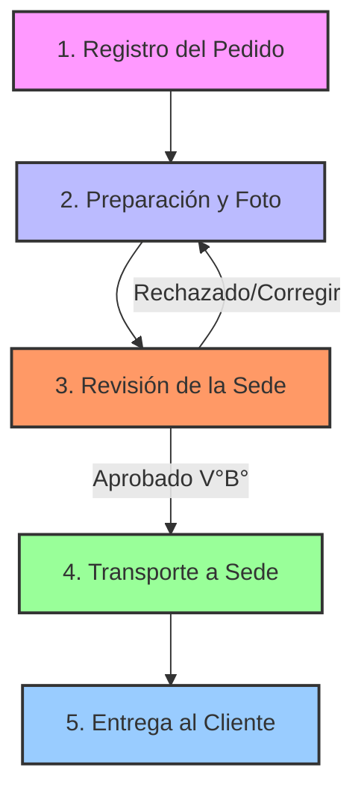
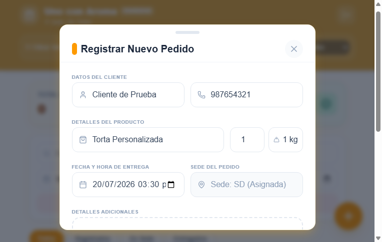
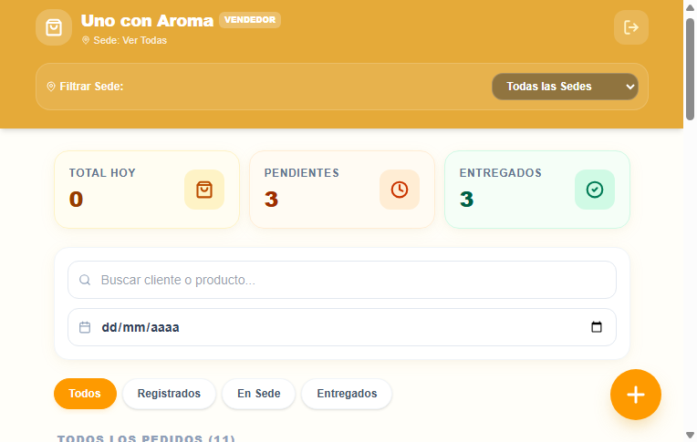
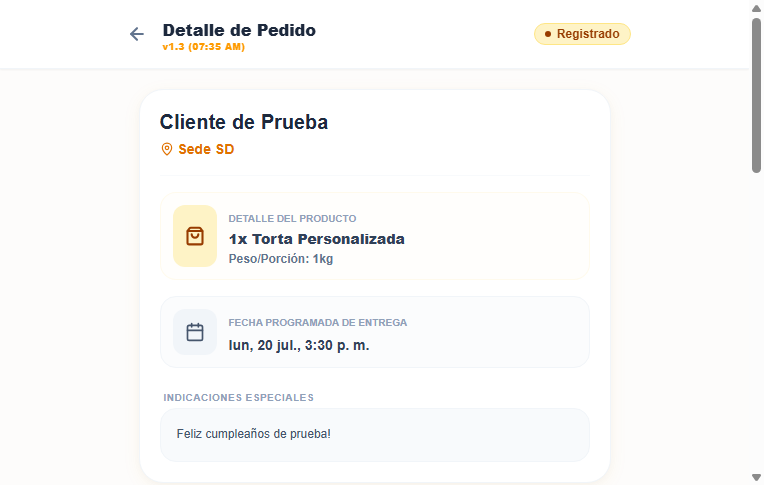
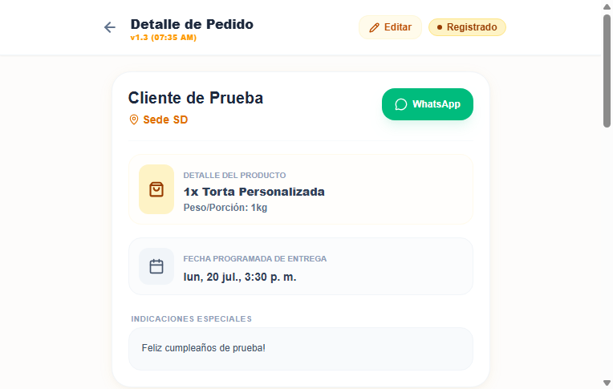
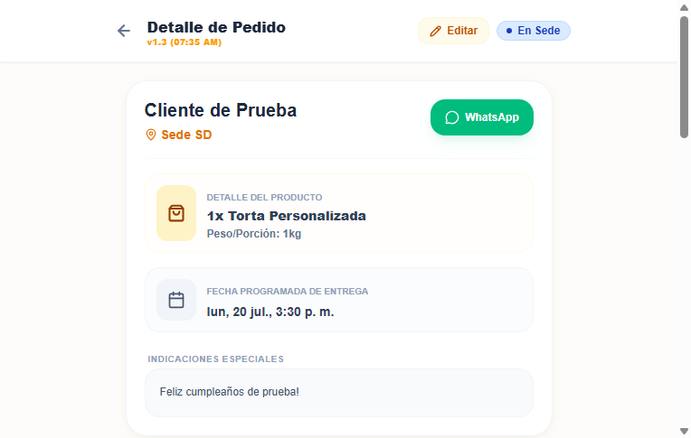
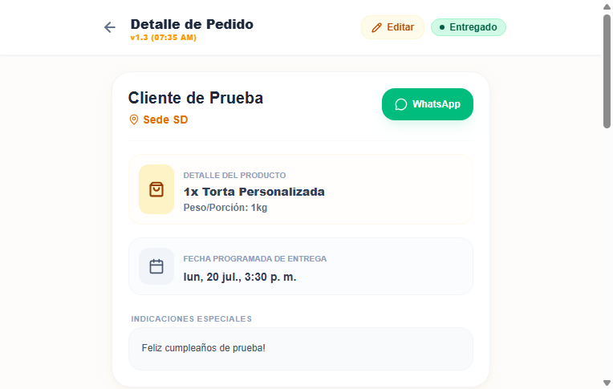

# Manual de Usuario - PedidosUCA
**Sistema de Gestión de Pedidos Centralizado - Uno con Aroma**

Este manual describe el funcionamiento global del sistema, los roles de usuario, las reglas de negocio automatizadas y las guías paso a paso para operar la plataforma.

---

## 1. Introducción al Sistema

**PedidosUCA** es una aplicación web progresiva (PWA) diseñada para coordinar la venta, producción y entrega de tortas y pedidos entre la administración general, la pastelería central y las diferentes sedes físicas (**San Diego (SD)**, **Florencia**, **Penta**, **Porvenir** y **Las Quintanas**).

### Demostración del Flujo Completo en Video
A continuación, se presenta una grabación interactiva del recorrido del sistema mostrando todos los pasos del flujo real:

---

## 2. Roles y Permisos en el Sistema

El sistema cuenta con tres perfiles de usuario distintos, diseñados para garantizar la integridad del flujo de trabajo:

| Funcionalidad / Permiso | Administrador (`admin`) | Vendedor (`vendedor`) | Pastelero (`pastelero`) |
| :--- | :---: | :---: | :---: |
| **Acceso a Panel Admin (Usuarios)** | Sí | No | No |
| **Crear y Editar Pedidos** | Sí | Sí (Solo su sede) | No |
| **Eliminar Pedidos** | Sí | No | No |
| **Ver Alerta de Pedidos de la Mañana** | Sí | Sí | Sí |
| **Ver Botones de WhatsApp del Cliente** | Sí | Sí | No |
| **Subir Fotos de Producción** | No | No | Sí (Solo en estado Registrado) |
| **Dar Visto Bueno (V°B°) / Correcciones**| Sí | Sí (Solo sede destino) | No |
| **Marcar "En Sede" / "Entregado"** | Sí | Sí | No |

---

## 3. Flujo Operativo del Negocio

El ciclo de vida de un pedido sigue un proceso lineal controlado para evitar que se entreguen productos sin supervisión:

### Reglas de Negocio Clave:
1. **Pedidos de la Mañana (Entrega 6:00 AM - 3:00 PM)**:
   * Si un pedido está programado para entregarse en la mañana, **debe ser preparado y enviado a la sede el día anterior**. El sistema mostrará una **alerta visual roja** destacada si el pedido sigue en estado "Registrado" el mismo día de la entrega.
2. **Restricción de Tránsito (Bloqueo de "En Sede")**:
   * Ninguna sede puede marcar un pedido como "Recibido en Sede" si no ha recibido el **Visto Bueno (V°B°)** de la foto de producción. El botón se mantendrá deshabilitado como `(Falta V°B°)`.
3. **Bloqueo de Fotos**:
   * Una vez que la sede aprueba la foto de producción, el Pastelero queda **bloqueado** para subir más fotos o realizar cambios sobre ese pedido.

---

## 4. Guía Paso a Paso para cada Rol

### 4.1. Para Administradores

#### Crear un Nuevo Usuario del Sistema
1. Ve al menú lateral y haz clic en **Panel Administrador**.
2. Rellena el formulario de registro:
   * **Nombre de Usuario**: Nombre de la persona (ej. *Pastelero Principal*).
   * **Email**: Correo corporativo o de acceso.
   * **Sede**: Asigna la sede física (la pastelería central opera en **SD**).
   * **Rol**: Selecciona entre *Administrador*, *Vendedor* o *Pastelero*.
3. Haz clic en **Registrar Usuario**. El perfil se sincronizará automáticamente en la base de datos segura.

---

### 4.2. Para Vendedores (Registro de Pedidos)

#### Crear un Nuevo Pedido
1. Inicia sesión como Vendedor.
2. Haz clic en el botón **Nuevo Pedido** en el Dashboard.
3. Rellena los detalles del cliente, producto, sede de destino, precio y fecha de entrega.
   

4. Haz clic en **Registrar Pedido**. El pedido aparecerá en el listado del día asignado.

---

### 4.3. Para Pasteleros (Producción Central)

#### Monitoreo y Subida de Fotos
1. Inicia sesión con las credenciales de Pastelero.
2. En la pantalla principal verás el panel de **Alertas de Hoy** con las tortas pendientes para hoy.
3. Haz clic en **Ver Ficha** sobre la torta que vas a preparar.
4. Toca el recuadro gris **Subir Foto Terminado (V°B°)** y selecciona la foto de la torta física.

---

### 4.4. Para Vendedoras (Sedes Físicas)

#### Revisión de Producción y Visto Bueno (V°B°)
1. Abre el pedido con foto en estado **Pendiente V°B°**.
2. En el panel de **Control de Producción**, evalúa la imagen:
   * Si está bien, presiona **Dar Visto Bueno**. El estado cambiará a **Aprobado**.
   

#### Recepción y Entrega del Pedido
1. Cuando el pedido llegue físicamente a la sede destino, haz clic en **Recibir en Sede**. El estado cambiará a **En Sede**.

2. Cuando el cliente recoja el producto final y liquide los saldos, haz clic en **Entregar Pedido a Cliente**. El pedido cambiará a **Entregado**.

---

## 5. Preguntas Frecuentes y Soporte

* **¿Cómo instalo la aplicación en mi celular?**
  * Abre la URL en Chrome (Android) o Safari (iOS) y selecciona **Agregar a la pantalla de inicio** o **Instalar Aplicación** desde el menú compartir.
* **No puedo subir la foto en mi iPhone**
  * Asegúrate de haber aceptado los permisos de almacenamiento y cámara del navegador. El botón utiliza la API nativa de captura para facilitar la subida de archivos pesados.
